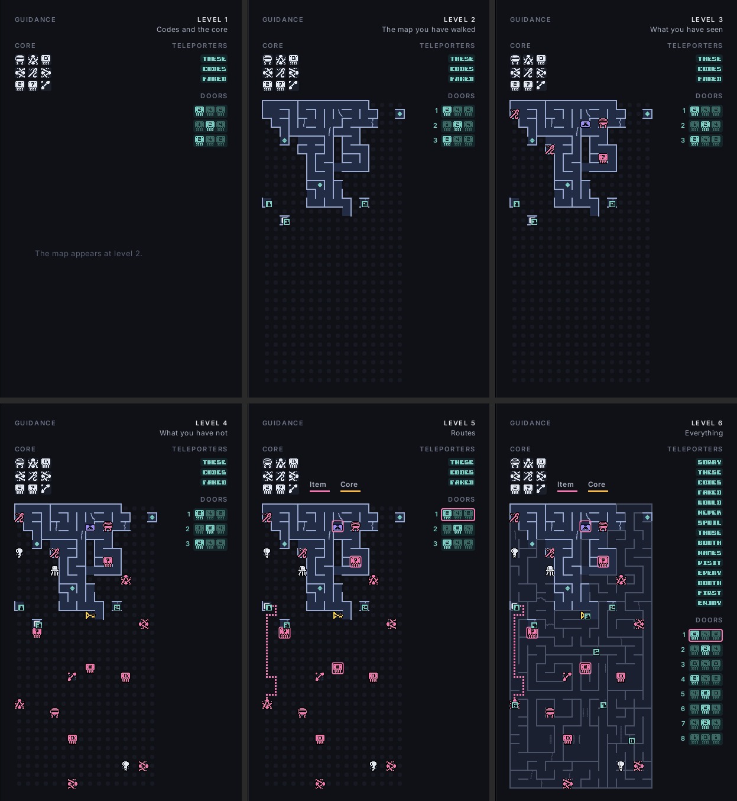

# ZX Sidekick for Starquake

Starquake (Stephen Crow / Bubble Bus, 1985), played from your own copy of the game.

**Not affiliated with or endorsed by the rights holders of Starquake or the ZX Spectrum.** You need your own copy of the game. ZX Sidekick contains no part of it: the original program you supply runs in an emulated Spectrum inside the app, unchanged.

> The plain game runs from your tape. See [`GOAL.md`](../../GOAL.md) for the aim and [`PLAN.md`](PLAN.md) for the steps and what comes later.

## The ROM

Not needed. Starquake calls only three ROM routines, and ZX Sidekick answers those calls itself ([`docs/rom.md`](docs/rom.md)).

## What works

- [x] The game runs from your tape with no ROM
- [x] Window with the Spectrum picture and its border
- [x] Sound (built; checked by ear)
- [x] Keyboard, and a joystick in every control method: the arrows with Left Control, or a gamepad with the bottom face button for down and the left one for fire, whatever their letters, and Start or the game's pause key to pause (built; checked by hand, the gamepad over Bluetooth)
- [x] The high-score table kept between runs in `high-scores.txt` beside the kept tape, with each entry's guidance level, listed beside the game's CORE OF HEROES screen; games with training mode are not kept.
- [x] Tape prompt: find or drop `starquake.tap` or its `.zip`, a link to World of Spectrum, the tape kept in the user data directory (built; checked by hand, dropping a tape included)
- [x] A notice while the game is paused, saying how to go on
- [x] The guidance panel beside the game, the picker for the guidance level and training mode's five switches (Esc, or Select on a gamepad), End this game and Exit, the note of how much help a game had beside the game-over screens, and pausing with Start or the pause key.
- [x] Guidance level 1: the codes you have been shown, in a rail down the panel's right in the game's own letters — every teleport you have entered, and under them the three key code cards each security door asked for once its screen has shown them, each card dimmed until something carried answers it — and the core's nine slots as a square of three by three at the panel's top left, each in the same place at every level, in the game's own graphics: what each still wants, what is delivered, and what you carry.
- [x] Guidance level 2: a map of the rooms you have walked through, with every edge shown open or closed and walls inside divided rooms.
- [x] Guidance level 3: what you have seen lying in those rooms, each item drawn with the game's own graphic at a whole number of screen pixels a game pixel, outlined, in the colour of what it does, and a missing core piece drawn as itself.
- [x] Guidance level 4: the same for the rooms you have never walked through, since the game knows where every item is from the moment a game starts.
- [x] Guidance level 5: a route to a missing piece, which Tab or the pad's top button switches between the three nearest, and one to the core while you carry a piece it needs, over the whole map as the map reads the rooms, dashed through rooms you have not visited, each drawn in its colour with an arrow in the border marked item or core, a legend of the two colours beside the core's slots, and the code of the teleport and of the security door the route needs next outlined in the rail in the route's colour. Tab, or the top face button on a gamepad, switches between the three nearest pieces. It assumes Blob can fly everywhere and that doors and secret passages work, with vacuum tubes only ever going up (built; checked by hand).
- [x] Guidance for security doors (#33): a key code card of a door's code lights up in the rail once what you carry answers it (that card, a "?" card for one missing, the access card for all); from level 2 each door in the rail has a number, on the door where it stands in its room and beside its code; at level 5 what a route's door still wants is ringed on the map in the route's colour, stand-ins included (built; checked on 2026-09-22 for #60, in staged play shown to the maintainer as pictures).
- [x] Guidance level 6: every teleport and door code whether you have been shown it or not, each door's made at every new game by the game's own code builder run on a copy of the machine, and the whole planet's map, the rooms you have never entered drawn dimmer (built; checked by hand).
- [x] Training mode's five switches, named as the game's manual names the bars: full energy, full bridging platforms, full laser, endless lives, no harm from enemies; each held while it is on, and named on the game's score (built; checked by hand, the five switches on 2026-09-22). No harm from enemies also stops the spinning tops that kill on touch, the impalers and the zap rays, by steering a register at the instruction the game decides each with, so nothing drawn changes (built; checked against the game, not yet played).

## Playing

```
cargo run --release -p zx-sidekick-starquake
```

The game starts fullscreen, and F11 (Control-Command-F on a Mac, where F11 never reaches a program) leaves it for a window as large as the screen allows: the picture is scaled by a whole number, so fullscreen is often a step larger than any window fits. The first time, the window asks for your copy of Starquake (`starquake.tap`, or the `.zip` it came in) and keeps it in your user data directory. A tape named on the command line is used as it is. The keys are the Spectrum's, so the title screen's own choices all work, Q for quit included: answer Y and the program closes once the game has said its goodbye. On top of that the arrow keys with Left Control (or Alt, comma or full stop) to fire, and a gamepad (the d-pad or left stick to move, the bottom face button for down and the left one to fire — A and X on an Xbox pad, B and Y on a Switch one, the cross and the square on a PlayStation one), are a joystick that works whichever control method you choose there: the machine presses the keys the game is listening for. Start or fire also starts a game from the title screen and goes past the intro text, so a controller alone gets you playing. Start, or the game's own pause key (Space, or the key you defined), pauses by freezing the emulation: the game never pauses itself, and the window says so over the picture; any key, a direction, fire or Start goes on. Right Control is Symbol Shift.

Beside the picture is the guidance panel. Esc, or Select on a gamepad, opens the picker and holds the game while it is open: up and down choose a row, left and right change it, Enter or A keeps the changes, and Esc, B or Select cancel them. The pad's letters are its own: A keeps and B cancels on an Xbox pad and on a Switch one alike, which is the bottom button on the first and the right one on the second, since that is where each has its A; a PlayStation pad keeps with the cross and cancels with the circle. The letters shown follow the maker the pad reports, so a controller with a mode switch shows what its own mode says. It sets the guidance level and training mode's switches, and asks before a change that would show on the game's score. End this game abandons the game in play the game's own way, by holding A S D F G, and Exit closes the program; both need a second press. Beside the game-over and high-score screens the panel says how much help the game had, and lists the high scores kept between runs with the guidance each was played with.

Each level adds to the ones below it:

| level | | codes you have seen | the core's slots | map you have walked | items you have seen | items everywhere | routes | every code, whole planet |
|:-:|---|:-:|:-:|:-:|:-:|:-:|:-:|:-:|
| 0 | Off | | | | | | | |
| 1 | Codes and the core | ● | ● | | | | | |
| 2 | The map you have walked | ● | ● | ● | | | | |
| 3 | What you have seen | ● | ● | ● | ● | | | |
| 4 | What you have not | ● | ● | ● | ● | ● | | |
| 5 | Routes | ● | ● | ● | ● | ● | ● | |
| 6 | Everything | ● | ● | ● | ● | ● | ● | ● |

**Levels 0 to 3 show only what you could have written down yourself; 4 and up tell you things you could not have known.**



*The panel at levels 1 to 6, drawn by the program itself on a real game. The game was staged rather than played: Blob was put through the rooms near the start, into three teleports and up against three security doors, and given a key code card "2" to carry. The teleport codes in it are not the game's: they were swapped for words in the staged game's memory, so the picture gives none away.*

- **Codes you have seen**, in a rail at the panel's right in the game's own letters: every teleport you have entered, and under them the three key code cards each security door asked you for once its screen has shown them. A card is dimmed until something you carry answers it: that card, a "?" card for one that is missing, or the access card for all three. A door takes nothing from you. The codes are forgotten when a new game starts.
- **The core's slots**, at the top left: the nine pieces in the game's own graphics, what each slot still wants, what is delivered, and what you are carrying.
- **The map you have walked**: every edge of a room open or closed, the walls inside a room, where you are, and the teleports you have seen. Each door whose code is in the rail has a number on it, where it stands in its room, and the same number beside its code.
- **Items you have seen** lying in those rooms, drawn in the game's own graphics and coloured by what each does: lilac for a key code card or the access card that opens any door, yellow for the key that opens space locks, white for something a trading pyramid takes, pink for a piece the core still wants.
- **Items everywhere**: the same for the rooms you have never walked through. The game places every item at the start of a game, so it knows where they all are; this tells you, ringed to say you have not been there.
- **Routes**: one to a missing piece and, while you carry a piece the core needs, one to the core. Each is a line on the map and an arrow in the picture's border marked "item" or "core", so they are told apart without colour; pink leads to the piece and orange to the core. The code a route needs next, a teleport's or a security door's, is outlined in the rail in that colour, and what that door still wants is ringed on the map where it lies. Tab, or the top face button on a gamepad, switches between the three nearest pieces. The routes run over the whole map, dashed through rooms you have not visited, and assume you can fly everywhere, that doors and secret passages work, and that vacuum tubes only go up: getting the items and the battery for that is your problem.
- **Every code, whole planet**: every teleport and door code whether you have been shown it or not, and the whole planet's map, the rooms you have never entered drawn dimmer.

Training mode is five switches beside the levels rather than a level of its own: full energy, full bridging platforms and full laser each fill their bar and keep it full; losing a life does not cost one; and nothing harms you: enemies drain no energy, and the spinning tops that kill on touch, the impalers and the zap rays cannot kill. A Full switch fills its bar when it goes on, by writing to the game's memory between frames and having the game draw its panel again with its own routine, and from then on keeps the game from taking from it at the instruction the game takes with, so the bar never shows short; endless lives is held by writing between frames; none of them changes the game; the last also steers a register at the three instructions the game decides an outright death with, and writes nothing, so everything is drawn and erased as the game meant. Every switch used shows on that game's score.

`--headless FRAMES [DIR [LEVEL]]` runs without a window, the joystick wandering at random, and writes PNGs of the window, picture and panel at that guidance level, the tape's loading picture first.

## How it is checked

Against your own tape, `SK_ASSETS=<folder with starquake.tap and 48.rom> scripts/check.sh` runs the checks against the game itself (`games/starquake/check`). `games/starquake/lab` holds tools that look rather than prove: a picture of the whole planet with every room's openings, probes, and the search behind guidance level 5's design. Measured on 14 September 2026 on `rustzx-z80` at the fork's commit `a73772d`; entry and rom were measured again on 24 September 2026 at `eac068f`, with the same results:

- **entry**: boots a real ROM, types `LOAD ""`, and feeds its loader the tape; the loader returns to `0x5E24` with the stack at `0x5E20`, exactly where ZX Sidekick starts the game.
- **rom**: through the menu, a new game and 6,000 frames of play under random joystick input, every call the game makes to the three ROM routines ZX Sidekick answers is repeated from the same state by the answer, and memory, stack and registers agree: 20,326 of 20,326 calls (226 more not compared because an interrupt landed inside them). The time each takes agrees too, on average: 895 T-states for the interrupt, 1,610 for printing a character, 541 for a control code, and 960 against the ROM's 969 for the multiply.
- **keys**: chooses each of the five control methods on the title screen in turn, starts a game, and drives it with the joystick alone: in every method each direction and fire move the picture where Blob is, the pause key is taken from the game while it plays on (also with the pause key redefined, where the Kempston method still pauses with Space and the others with the defined key), Start or fire alone gets from the title screen into play, and the control method, its key tables and the pause key read as recorded.
- **facts**: the entry points the guidance panel follows arrive in order, the menu and then play, and holding A S D F G from the top of the play loop, as End this game does, reaches the game-over screens and comes back to the menu, in all five control methods; the teleport table holds fifteen five-letter codes in fifteen rooms, and walking into each teleport has the game print the code the table gives for its room, 15 of 15. In 6,000 frames of play under random input, every room walked into is marked visited in the game's own set within 12 frames: 18 of 18. Of the rooms the map marks as holding a missing core piece as a game starts, the game places a wanted piece in each when it enters the room: 16 of 16, each at a spot inside a part of the room as the map reads it, where a level 5 route ends. The game draws each of those pieces from the graphics table the core column reads, 16 of 16, and walking into the core draws each hole with the graphic and colour the column uses. The high-score table is the tape's STARQUAKES, and a table written into memory once the tape is loaded, as the app does, is the one a game's score is ranked against: End this game's score lands fourth in a table made for it, the rest moved down, all in place when the CORE OF HEROES screen comes up. Every security door walked into shows three key code cards, and the game's code builder run on its own on a copy, which is how level 6 reads them, makes the same three for every door, in two games with different seeds. Walked into a door with a made-up inventory, the door's own screen answers the slots the panel lights (nothing, the three cards, two of them, the access card, a "?" card with two cards), lets Blob through only with all three, and takes nothing from what is carried. On the title screen Q then Y arrives, after the game's own 255 frames of goodbye, where it begins wiping itself, which is where the window closes the program; Q then N goes back to the menu and never does.
- **facts** also types another teleport's code and finds the game entering the next room by teleport, and every room entered while walking about entered as walked, which the level 5 route relies on to tell a walked connection from a teleport.
- **map**: has the game draw each of the 512 rooms on a copy of the machine and reads the map from them, then walks Blob at random through play from 60 rooms. He never leaves a room through an edge the map shows closed, nor crosses a wall it shows inside a room: 1,124 of 2,048 edges open, 27 rooms divided inside, 243 room crossings and 48,372 positions walked, none against the map. It also walks Blob into every secret passage from the side he can stand beside it: all 22 take him to the room on that side, and the map joins exactly those 11 pairs of rooms, since a secret passage leads only one way. The same walks are held against level 5's graph of the planet, 532 places and 1,154 ways: every one of the 243 crossings between rooms beside each other is a way in it, and from where play starts it reaches 500 rooms without a teleport.
- **training**: 1,200 frames of the same scripted play from one saved start, under each switch alone. With every switch off, energy drains to 3 of 123 and a life is lost; full energy never lets it below 127; the bridging platform and laser bars end no lower than they started where a plain run spends them; endless lives never falls below where it started, where a plain run does; and full energy with no harm from enemies together leaves energy untouched at 127. Then the bars are run down in play, the bridging platforms laid and the laser fired to nothing and energy taken by time, and each of full energy, full bridging platforms and full laser alone fills its own bar to 127, the most the panel draws, a frame later, leaves the other two as they were, and a few frames on the panel shows them as the game's own panel routine draws them. With the three Full switches on, 600 frames of firing and laying bridging platforms never let a bar fall below full at any instruction, though the game goes to take from them. With every switch off nothing is written, so the play ends exactly as the game left it. Then the outright deaths, on a copy of the machine in rooms holding no other danger: Blob stood on a thing that kills on touch in 10 rooms, on an impaler in 6 and in a zap ray in 6 dies in all 22 with no harm from enemies off and in none with it on, and the three instructions the switch steers hold the bytes recorded.
- **By eye**: headless screenshots of the loading picture, the title screen and play.

The processor and CI are checked for every game: see the [repository's README](../../README.md#how-it-is-checked).
